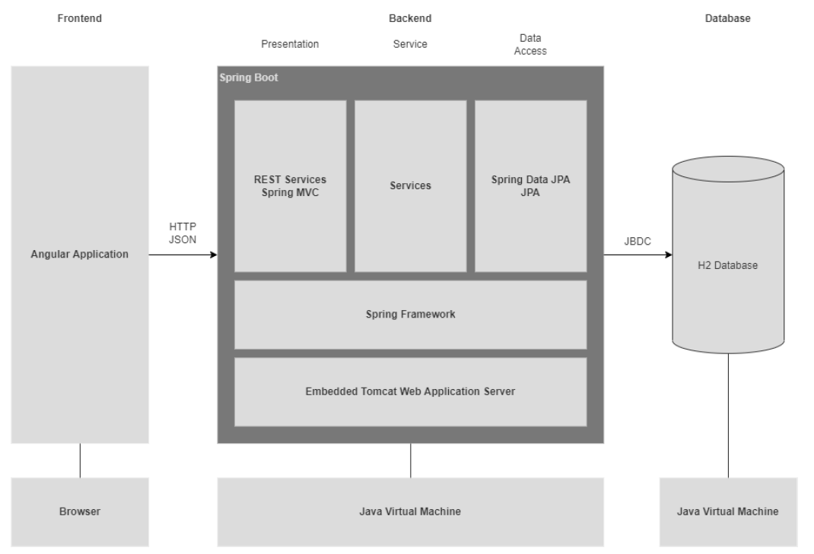

[comment]: <> (Das Designdokument setzt direkt an die Softwarearchitektur an und verfeinert die in der
Softwarearchitektur getroffenen Entscheidungen. Der Übergang zwischen Softwarearchitektur
und Software Design ist dabei fließend. Im Gegensatz zur Softwarearchitektur werden beim Software Design auch Entscheidungen getroffen, die sich auf die Implementierung beziehen.)

### Models of the application core structures
[comment]: <> (Modellieren Sie wichtige wiederkehrende Strukturen der Applikation in Form eines Klassendiagramms.
Wenn Sie ein Framework einsetzen, dokumentieren Sie das Zusammenspiel und
die Integration des Frameworks in die Applikation. SUBJECT TO CHANGE!)

### Used Patterns
[comment]: <> (Welche Patterns werden wie innerhalb der Applikation eingesetzt?)

- **Dependency Injection**: Uses containers to dissolve dependencies
- **Interfaces**: Separate interface and implementation of functionality
- **DTOs**: Transport data between layers
- **Factory Pattern**: Use of builder objects to create objects

### Domain model
[comment]: <> (Das Domänenmodell umfasst die Klassen und Objekte der Domäne, jedoch keine technischen
Klassen wie DAOs oder UI-Klassen. Es kann in Form eines Klassen- oder EER-Diagramms
modelliert werden.)

### Exception-Handling

The project uses checked exceptions for situations expected to occur during regular use. Unchecked exceptions are used for unexpected errors.
Application specific exceptions: ValidationException, NotFondException, ...

### REST Spezifikation
[comment]: <> (Definieren Sie die URLs unter denen die einzelnen Serverfunktionen erreichbar sind. Hierfür
reicht als Dokumentation die Swagger UI aus.)
Swagger UI, accessible via:

http://localhost:8080/swagger-ui/index.html#/login-endpoint/login

### Logging
[comment]: <> (Welche Log-Levels werden eingesetzt? Definition welche Log-Nachrichten auf welchem Log-
Level ausgegeben werden.)

Four different log levels are used:
- **error** for logging errors, especially exceptions
- **info** for actions undertaken by the user
- **debug** for allowing greater insight into complex pieces of code, for finding mistakes
- **trace** for deep code dives not covered by debug, should be avoided

### Security-Aspekte
[comment]: <> (Wie erfolgt Authentifizierung und Authorisierung innerhalb der Applikation? Welche Techniken
werden eingesetzt, um Sicherheitslücken in der Applikation zu verhindern?)

Prepared statements to hinder SQL-injections.
Heavily restricted functionality to non-authenticated users.
Only Password hashes are stored.
No storage of payment details.
