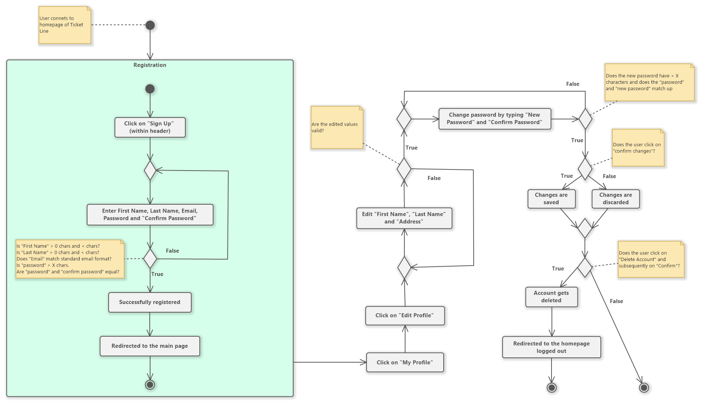
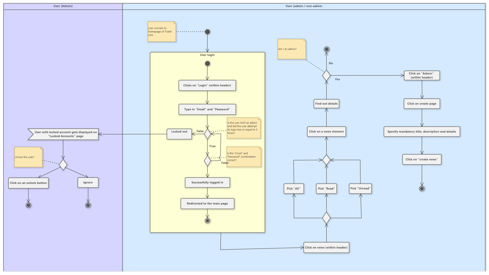
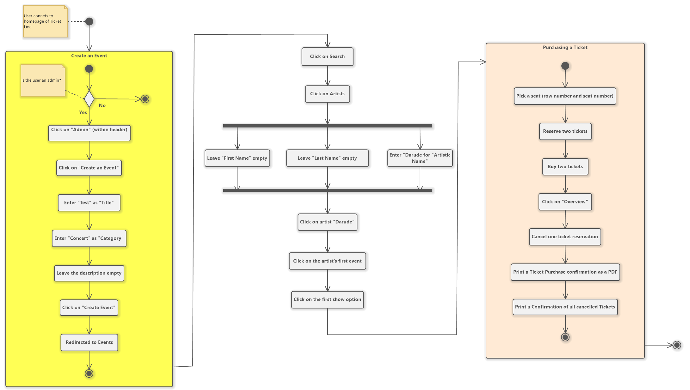

### 2.1.1 Registration & 2.1.4 Customers

 The following scenario covers the user stories 2.1.1 Registration and 2.1.4 Customers. The process starts with a user connecting to the homepage of Ticket Line. The user does not have an account yet, so he/she proceeds to clicking on the sign-up button contained within the header. There the user is shown a form where the fields for first name, last name, email, password and "confirm password" need to be filled. If those fields receive invalid inputs, the user will be informed and given a reason why that input is not permissible. Invalid inputs include any of the fields being blank or longer than a certain number of characters, an email that does not match the standard email format and a password that does not match the "confirm password" field. Once all inputs are valid, the user becomes successfully registered and is redirected to the main page. As the user now has an existing account, he/she can now also look at their profile by clicking on a button with the label "My Profile" and from there click on "Edit Profile". The user can edit inputs first name, last name as well as address. If the user also wishes to change the password, then it also needs to be confirmed by typing the new password again within a "confirm" password field. Finally, the user can decide whether the changes should be saved permanently by clicking on a "confirm changes" button. Lastly, the user can delete the account by clicking on a "Delete Account" button and subsequently clicking on "Confirm". Once that happens, the user is logged out and gets redirected to the homepage.

### 2.1.2 Authentication & 2.1.3 News

 This scenario covers user stories 2.1.2 Authentication and 2.1.3 News. The user connects to the homepage of Ticket Line and clicks on Login. This redirects the user to the login page where he/she is tasked with entering an email and a password. The user has five attempts to enter the correct combination for a certain email, after the fifth unsuccessful attempt, the user is locked out. In that case, the user must wait for the admin to unlock the account. If the inputs are correct, the user is successfully logged in and redirected to the main page. The user proceeds to the news section by clicking on "News" located within the header. There he/she can filter news by either picking "All", "Read" and "Unread". To find out more details, the user can click on a news element which redirects him/her to a detailed view of that news section. If the user is also an admin, the user can click on an "Admin" button within the header. This redirects the admin to the admin page, where the user can click on "Create page". There he must specify title, description, and details. Once the inputs are provided, the user can click on "Create news" leading to a successfully created new news section.

### 2.1.5 Events & 2.1.6 Tickets & 2.1.7 Print

 In this scenario are the user stories 2.1.5 Events, 2.1.6 Tickets and 2.1.7 Print. Once a user connects to the homepage of Ticket Line, he/she can create an event if the user has the role of an admin. If so, the user can click on admin, click on click event and then specify the following inputs: title, category, and a description. In the following example, the title is "Test", category is "Concert", and the description has been left blank. Once the event is created, the user is redirected to the events page where all the events are displayed. This is followed by the user clicking on "Search", "Artists" to search for artist. The search takes the inputs first name, last name, and artistic name. In our example, the user only specifies the artistic name with "Darude", which returns a list of artists containing that string of characters. The user clicks on the artist "Darude", then clicks on the first event from a list of events, then clicks on the first show from a list of shows. The next collection of events portrays the process of ticket purchase. First the user picks a row number and seat number. This is followed by reservation and/or purchase of ticket(s). To see the reserved and/or bought tickets, the user can click on "Overview" and cancel a ticket. The user can print a list of purchased tickets as well as cancelled tickets.