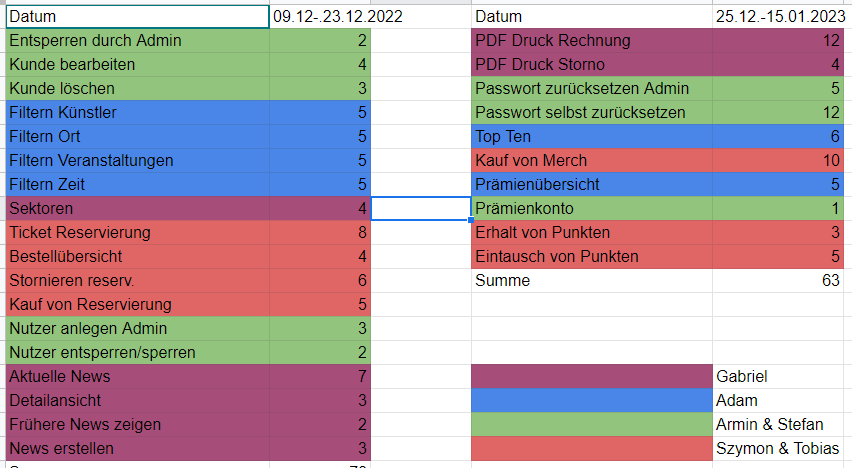

### 4.11.2022, 15:00-15:30: Kickoff-Meeting with the tutor

Present: All, Place: Zoom-Meeting

Assigning the roles:

* Teamcoordinator: Stefan Trenovatz
* Tester: Szymon Karabin
* Technischal architect: Gabriel Haubenburger, Stellvertreter Muhammad Adam Ferdin
* Documentation: Tobias Gacko
* Usability Engineer: Armin Kazda
* Security & Performance: Muhammad Adam Ferdin

Weekly meeting will take place on Thursday, 20:00

### 4.11.2022, 15:40 - 16:00: Diving documents among the members (Subpoint 5 in SEPM Group-stage document)

Present: All, Place: Zoom-Meeting

| Document | Responsible |
|----------|-------------|
| User-Analysis: 5.1, 5.13 | Stefan |
| Architecture, Design, Development: 5.10, 5.11, 5.12 | Gabriel |
| Tests: 5.7, 5.8, 5.9 | Szymon |
| Mockup: 5.6 | Armin |
| Risks: 5.5 | Adam |
| Scenarios: 5.2, 5.4 | Tobias |

<table>
<tr>
<th>

</th>
<th>Responsible</th>
<th>Replacement</th>
</tr>
<tr>
<th>Teamcoordinator</th>
<td>Stefan Trenovatz</td>
<td>Armin Kazda</td>
</tr>
<tr>
<th>Tester</th>
<td>Szymon Karabin</td>
<td>Tobias Gacko</td>
</tr>
<tr>
<th>Technical Architect</th>
<td>Gabriel Haubenburger</td>
<td>Adam Ferdin</td>
</tr>
<tr>
<th>Documentation</th>
<td>Tobias Gacko</td>
<td>Szymon Karabin</td>
</tr>
<tr>
<th>Usability Engineer</th>
<td>Armin Kazda</td>
<td>Stefan Trenovatz</td>
</tr>
<tr>
<th>Security and Performance</th>
<td>Adam Ferdin</td>
<td>Gabriel Haubenburger</td>
</tr>
</table>

### 10.11.2022, 19:00 - 20:00: Internal Meeting

Present: All, Place: Zoom-Meeting

Language for documents: English

Decision regarding picking the two expanded mandatory user stories

* 2.2.1 "Merchandise und Prämien"
* 2.2.2 "Benutzerverwaltung"

Briefing regarding the state of the documents.

* 5.1 Finished
* 5.2 Halfway finished
* 5.5 In process, need to calculate the risks, need to rank the risks and keep an eye on it
* 5.7 Almost Finished
* 5.8 In process
* 5.9 In process
* 5.10 In process
* 5.11 In process
* 5.12 In process
* 5.13 Needs to be done later

TODO until next meeting: Each member needs to assign story points to the user story sections.

* Registration as benchmark: 5 points

Stefan creates PowerPoint presentation.

In case of MR1 taking place on tuesday: Internal meeting on the Monday, 14.11.2022.

### 10.11.2022, 20:00 - 20:33: Meeting with the Tutor

Anwesend: Alle Ort: Zoom-Meeting

Date for Managementinterview is expected next week, exact date not set yet.

PowerPoint presentation are pretty much mandatory for MR1 and MR3, should cover most if not all documents.

Users do not need to be described in further detail.

Milestones refer to sprints.

Members should not push too often, each push should cover a finished features.

* Advisable Dev-branch on which there are feature branches

TODO:

* Upload the template
* Create branches
* Templates for manual systemtests, test protocols and test reports need to be created
  * Tables are advisable

### 15.11.2022, 10:30 - 11:50: Internal Meeting - Story Points

Present: Everyone, Place: Zoom-Meeting

Determining the Story Points and priorities for each User Story (subpoints)

**15.11.2022, 14:30 - 15:00: Internal Meeting - MR1 preperation**

Present: Everyone, Place: Zoom-Meeting

Short recap of how the presentation for MR1 will be held.

### 15.11.2022, 15:00 - 16:50: MR1 presentation

Present: Everyone, Place: Zoom-Meeting

**Insights:**

* Usability is important, take the view of the user into account
* **CONTINUALLY WORK ON THE PROJECT,** planning plays a big role during grading
  * Starting for example in January will influence the grade negativelly
* Documentation must be comprehensible for colleagues
* MR1 and MR2 goal: Help/Guide for the team, actual grading in MR3
* Try to finish as much as possible before Christmas
  * Probability for catch-up's during christmas are low

**Needs improvement:**

* 5.2 Scenarios
  * Divide diagrams into Admin and User
* 5.5 Risk Management:
  * Not all calculations are correct
  * Add lack of experience with technology as risk
* 5.6 User Interface Mockups
  * Date/Place filter needed (Cinema example by tutor) in search
    * User needs as many filters as possible
* 5.7 Test plan
  * System tests missing
  * Which test technology to use in backend and frontend?
  * More detailed specification for what is tested when a feature is implemented
    * (For example, test does not take place every 2 days but after each sprint)
* 5.12 Development Guidelines: Code Conventions need to be sp[ecified further](https://owasp.org/www-project-top-ten/https://owasp.org/www-project-top-ten/)
* REST API Security: https://owasp.org/www-project-top-ten/

### 17.11.2022, 19:00 - 19:30: Dividing User Stories tasks among members

Present: Everyone, Place: Zoom-Meeting

Topic(s):

* Dividing User Stories (from Story Point category High) among members
* Potential Sprint dates

| User Story | Story Points | Responsible |
|------------|--------------|-------------|
| Registration | 5 | Armin & Stefan |
| Account lock & login | 5 | Armin & Stefan |
| Create an event | 5 | Adam |
| Seating plan | 15 | Gabriel |
| Ticket purchase | 15 | Tobias & Szymon |
| Ticket cancellation | 8 | Tobias & Szymon |

### 24.11.2022, 19:00 - 20:00: Internal Meeting

Present: Everyone, Place: Zoom-Meeting

Topic(s): Current state of each Story, discussion regarding the domain model

**Armin & Stefan:** Registration in progress, missing Validation.

**Adam:** Create Event in progress

**Gabriel:** Focus on Domain Model, Hall plan in progress

**Szymon & Tobias:** Ticket purchase in process

### 24.11.2022, 20:35: Meeting with the Tutor

Present: Everyone, Place: Zoom-Meeting

Domain model discussion conclusions

* **Artist** relation to **Event** instead of **Art**. **TicketAcquisition** is missing a link to the **Stages**.
* How to differ between standing and sitting places?
* The **Event** contains the **Date** and **Duration**, the **Act** the **Time of Day** and **Duration** attributes.

Create Event

* Should event categories be pre-defined or should an admin also be able to create categories.

Veering off SCRUM-Guidelines is allowed to a certain extent, as long as a member does not start working on a story someone else is already working on.

Speed during first sprint may need to increase.

Domain model expected to be finished until next week

**INTERNAL REVIEW: ~~Tuesday, 6th December 14:30 - 15:45~~**

* UPDATE: Date of internal review is now on Thursday, 8th December

### 01.012.2022, 19:00 - 20:00: Internal Meeting

Present: Everyone, Place: Zoom-Meeting

Topic(s):

* Current state of each Story
* How does storing with JPA work
* Sprint planning and respective story planning

**2nd sprint date:** 08.12.2022 - 23.12.2022

**3rd sprint date:** 01.01.2023 -15.01.2023

### 01.12.2022, 20:00 - 20:45: Weekly meeting with the Tutor

Present: Everyone, Place: Zoom-Meeting

Topic: Current state of each member/group with their current story.

**Next meeting** on Thursday, 08.12.2022 at 16:00

### 08.12.2022, 13:00 - 15:15: Internal meeting

Present: Everyone, Place: Zoom-Meeting

Topics:

* Stage plan (Gabriel): Stages are not dynamic
* Create Events (Adam): Artist is missing, Stages creation in frontend requires more functionality
* How to handle store and online purchase? Should we also have an Employee role with Admin rights?
* For tests are issues expected

Merged all branches into dev

Questions for Tutor:

* Is it alright if the locations are pre-defined
* How to handle store and online purchase? Should we also have an Employee role with Admin rights?

### 08.12.2022, 16:00 - 17:15: Internal Review

Present: Everyone, Place: Zoom-Meeting

The domain model also requires a "Seat" object, so that it is locked when two users are trying to reserve a seat when they are on the webpage.

Domain model is a little bit chaotic (address should be below location?). Point of a domain model is to provide a clear overview.

Homepage could use an edit.

Registration could use a confirm password

Event - duration: It should be specified that it is in minutes

* What is an event takes more than

Name "Act" should be changed

Frontend may or may not need End-to-End tests

Creating location is not a requirement, but it makes sense from the perspective of an admin to have the option to create a new location.

* Tutors suggested that creating locations should be available

Login Security: Edit "false password - x many" retries ?

* Hall plan can fit into any location

For MR2 (in 2 weeks): Test Data is expected

Login & Registration Sprint is not finished

Adam has too many hours compared to others

Story points need to be re-evaluated, depends on tutor

.idea folder within the project, should not be

### 08.12.2022, 17:15 - 17:45: Internal Meeting

Present: Everyone, Place: Zoom-Meeting

Quick discussion over distribution of the workload.

Story point new assessment discussion on Saturday around lunch

### 10.12.2022, 12:00 - 13:00: Internal Meeting: Re-evaluation of Story Points

Present: Armin, Gabriel, Szymon, Tobias, Place: Zoom-Meeting

Topics:

* Discussing new story point distribution
* **How to handle seat-locks:**
  * Either through tickets (which will then have three categories: locked, reserved, purchase)
  * Or create "Seat" class
* **For how long are tickets stored:**
  * Either Frontend stores the tickets as long as the browser is open/closed, the user is logged in
  * Or backend sets timestamps (e.g. ticket is stored only for 10 minutes)

### 12.12.2022, 18:00 - 19:00: Internal Meeting: Re-evaluation of Story Points

Present: Everyone, Place: Zoom-Meeting

Topics:

* Evaluation of stories again
* Ticket logic discussion
* Merging Filter by Artist, Location, Events and Time/Date to one User Story
* Merges on dev branch now every week

### 15.12.2022, 19:00 - 19:40: Internal Meeting: Current state of sprint

**Present:** Everyone, **Place:** Zoom-Meeting

Topics:

* Current state of each sprint story
  * Lock/Unlock User in the frontend
  * Unique Constraint regarding Stages/Tickets

### 15.12.2022, 20:00 - 20:30: Internal Meeting: Weekly Meeting with Tutor

**Present:** Everyone, **Place:** Zoom-Meeting

Topics:

* Current state of each sprint story
* MR2 is on 20.12.2022 Tuesday 15:00

### 16.12.2022, 14:00 - 16:45: Internal Meeting Merging branches on dev branch

**Present:** Armin, Gabriel, Stefan (15 min), Tobias, **Place:** Zoom-Meeting

Topics:

* Merging Lock/unlock user function by admin, Stage plan and Ticket acquisition
* How to implement the price for act/stages

### 19.12.2022, 17:00 - 19:00: Internal Meeting Preparation for MR2

**Present:** Everyone, **Place:** Zoom-Meeting

Topics:

* Current state of each story in Sprint 2
* Merging each branch onto dev

### 20.12.2022, 15:00 - 16:10: MR2

**Present:** Armin, Gabriel, Stefan (15 min), Tobias, **Place:** Zoom-Meeting

* Still a lot of work ahead
* MR3 around 23rd January
* Automated tests need not to be documented
* Stage plan should provide option for reservation/purchase
* Ticket Acquisitions could use a button to see stage plan of the event for which a ticket has been acquired

### 23.12:2022, 19:30 - 21:30: Internal Meeting

**Present:** Armin, Gabriel, Stefan (15 min), Tobias, **Place:** Zoom-Meeting

Topics:

* Stefan:
  * Query logic for event search will check for null entries
* Adam:
  * No Unit tests for Event
  * Should every Mapper and Repository be tested?
  * Auto-complete feature finished
* Armin & Gabriel:
  * Backend fully finished
  * Frontend lacking pricing
* Szymon & Tobias:
  * Verify connection with stage plan
* Would be appreciated if when varying off domain model would be mentioned before implemented
* Merge to dev branch preferably when the other branch is in a more or less finished state
* Sprint 3 newly distributed
  * Szymon & Tobias or Adam take over Premium account?
* Armin from 29.12. - 05.01 not present

  **Jour fixe on Thursday, 05.01.2023, 20:00?**
* Internal meeting next wednesday, 28.12, 17:00

### 28.12.2022, 17:00 - 18:00: Internal Meeting

**Present:** Everyone, **Place:** Zoom-Meeting

**Topics:**

* How to generate Data for Act_Sector Mapping
* Event Endpoint blocked by Secured Role
* Angular folder issues

### 05.01.2023, 20:00: Weekly meeting with the tutor

Cancelled

### 12.01.2023, 19:00 - 20:00: Internal Meeting

**Present:** Everyone, **Place:** Zoom-Meeting

**Topics:**

* Stefan - Email reset
  * Outlook mail used for reset password gets locked, recognized as spam mail. Gmail alternative?
  * Fixing error messaging in the Frontend
* Adam - Top 10 events
  * Last month meaning literally last month or last 30 days?
  * If it is sold out, what then?
* Dev Branch 21 test fails
* Tobias - Merch
  * Quantity limited to 10
  * How to do the point overview

### 12.01.2023, 20:00 - 21:30: 12.01.2022

**Present:** Everyone, (Stefan until 20:30), **Place:** Zoom-Meeting

**Topics:**

* Internal meeting topics
* Test Search not working properly
* Error when starting Angular
* @ROLE_ADMIN causing errors in events
* Pageable for event + merch

**Internal Review:** 19.01.2023, 20:00 (not final yet)

**MR3:** 31.01.2023, 15:00 (not final yet)

### 13.01.2023, 15:00 - 16:25:

**Present:** Armin (1 hour), Gabriel, Szymon, Tobias, **Place:** Zoom-Meeting

**Topic:**

* How to handle ticket cancellation
* Ticket purchase and merch purchase will be documented in invoices, ticket reservations will not
* Frontend header mobile version square has no functionality
* Act - ActServiceMapping generation

16\.01.2023, 15:00 - 16:25:

Topic:

* Sprint

### 19.01.2023, 18:00 - 20:00: Internal Meeting

**Present:** Everyone, **Place:** Zoom-Meeting

**Topic:**

* Trying to resolve conflicts when merging the ticket branch on the dev branch

### 19.01.2023, 20:00 - 21:00: Internal Review

**Present:** Everyone, **Place:** Zoom-Meeting

Topics:

* Try to have a presentable project

### 19.01.2023, 21:00 - 21:10: Internal Meeting

**Present:** Everyone, **Place:** Zoom-Meeting

Topics:

* Next Internal Meeting: 22.01.2023, Sunday, 18:00
* Dividing tasks among members

### 22.01.2023, 19:00 - 20:20: Internal Meeting

**Present:** Everyone except Armin, **Place:** Zoom-Meeting

Topics:

* Tobias - Merch: Buttons correspond to the state of the merch in the cart
* Stefan:
  * Admin - users overview: Added a load more users button
    * Email to tutor: Is pagination MANDATORY?
  * Events - Acts: Buy Tickets, Reserve Tickets should contain a login button
  * Should address be linked to user?
* Gabriel, Szymon - Ticket:
  * Cancellation of reserved tickets no longer works - is it necessary?
* Events, Acts - Frontend:
  * Acts in the past should not be displayed, events with only acts in the past should not be displayed
* Ticket acquisitions & reservations in profile page:
  * In case of pagination: display acquisitions and reservations 1:1

#### TODO until Thrusday:

* Implement row into tickets (Looking at you Armin)
* Have functional tests
* Correct shopping cart icon - amount not correct
* Orders are displayed properly
* Limit amount of tickets
* Admin button when looking at Acts / Events

Next Meeting: Wednesday, 19:30

### 25.01.2023, 19:30 - 21:00: Internal Meeting

**Present:** Everyone except Szymon, **Place:** Zoom-Meeting

Topics:

* Pagination implemented in Merch, Events, Profile (orders).
  * Is pagination necessary in users?
  * Missing in users
  * Combining
* Profile
  * Sector, Row and Seat are still Question Marks
  * Cancelled tickets should no longer have buy option
  * Should orders have previous status displayed when they are cancelled? (E.g., Purchase, then Cancelled)
  * 
* Design
  * Replace [localhost:4200](http://localhost:4200) warning message with angular warning
  * Implement Profile Button
  * When page width is smaller, header hides all options in a button which does not work functionally
  * Make stages with seats only looking east/west nicer
  * Make footer bigger
* When not logged it / not allowed role -> reroute to login
* Display news when not logged in, hide button

Tasks

* Adam
  * Store more data
  * How to add images
* Gabriel:
  * Edit profile
* Armin:
  * Pagination
* Stefan:
  * Pagination
* Tobias:
  * Design

### 26.01.2023, 19:00 - 20:00: Internal Meeting

**Present:** Everyone, **Place:** Zoom-Meeting

Topics:

* TODO: Fix Error messaging when creating user as admin
* Show more clearly the borders of the sectors, communicate more directly why the prices differ
* Option to collapse tickets in the shopping cart

### 26.01.2023, 20:00 - 21:45: Internal Meeting

**Present:** Everyone, **Place:** Zoom-Meeting

Topics:

* Invoice ID should not be the ID
* Cancellation should link to a purchase
  * Profile: Display Cancellation below purchase/Purchase below cancellation?
* Does it make sense to split invoices only consisting of reservations and reservations with purchases?
* Set admin -> users results lower (20 too much)
* Shopping cart: Split reservation and purchase
* Add option to go to Top 10
* Where to put top 10 Events?
* Warning message when setting password in registration and they are not the same is not shown
* Merch correction

### 26.01.2023, 18:00 - 19:52: Last Internal Meeting before MR3

**Present:** Everyone, **Place:** Zoom-Meeting

Topics:

* Everyone finish their JavaDocs
* Deleting users issues
* Pipeline still red
* How to display top 10 events
* Sprint 4 retrospective